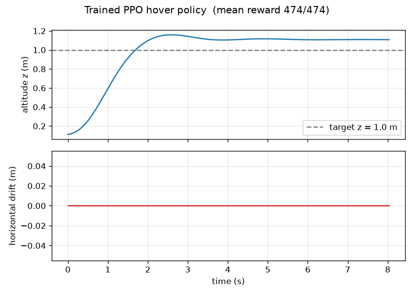

# Drone RL — Assignment 3 (CMS)

Reinforcement learning for quadrotor control, built on
[`gym-pybullet-drones`](https://github.com/utiasDSL/gym-pybullet-drones) (PyBullet physics)
and [Stable-Baselines3](https://github.com/DLR-RM/stable-baselines3) PPO.

**Status:** first milestone done — a PPO agent learns to take off and hold a hover
at 1.0 m altitude. Mean reward **474.1 / 474** ("perfect") over 20 evaluation episodes,
trained in **160k steps (~6.5 min on a laptop CPU)**.



---

## Why PyBullet and not MuJoCo

| | PyBullet (`gym-pybullet-drones`) | MuJoCo |
|---|---|---|
| Ready-made quadrotor env | **Yes** — Crazyflie model, Gymnasium API, SB3 examples, PID baselines | No maintained drone package; you build the env yourself |
| Physics | Good for rigid-body quad dynamics | Better contacts, generally faster |
| Time to first training run | Minutes | Hours of infrastructure first |

For a first RL-on-drones project the deciding factor is that PyBullet gives a working
hover / waypoint environment on day one.

### Note on "real DJI drone" transfer
Consumer DJI drones (Mini / Air / Mavic) expose **no low-level motor or attitude control**,
so a policy that outputs rotor thrusts has nothing to send them to. Real sim-to-real would
need a DJI/Ryze **Tello** (high-level velocity commands only) or a custom PX4 / Betaflight
build. That is out of scope for this assignment — we train in simulation.

---

## The task (`HoverAviary`)

- **Agent:** one Crazyflie 2.X quadrotor
- **Goal:** reach and hold position `(0, 0, 1.0)` m for an 8 s episode
- **Observation** (`kin`, 27-dim): position, orientation, linear & angular velocity, plus a short action history
- **Action** (`one_d_rpm`, 1-dim): a single scalar per step, applied as equal RPM to all four motors — the simplest action space, learns fastest
- **Reward:** shaped, ~474 ≈ a stationary hover exactly on target

---

## Repository layout

```
CMS/
├── README.md                 <- this file
├── SETUP.md                  <- exact environment setup (Windows + conda)
├── PROGRESS.md               <- what's done / what's next
├── requirements-lock.txt     <- exact package versions used
├── scripts/
│   ├── quickstart_train.py   <- PPO training, early-stops when solved
│   └── quickstart_eval.py    <- headless evaluation + trajectory plot
└── results/
    ├── best_model.zip        <- trained policy (load with PPO.load)
    ├── final_model.zip       <- policy at end of training
    ├── evaluations.npz       <- reward vs timesteps (EvalCallback log)
    └── hover_trajectory.png  <- altitude / drift of the trained policy
```

`gym-pybullet-drones` itself is **not** vendored here — it is installed as a dependency
(see `SETUP.md`). These scripts import it as a normal Python package.

---

## Reproduce

Once the `drones` conda environment exists (see [SETUP.md](SETUP.md)):

```bash
conda activate drones
cd path/to/CMS/scripts

# train (writes results_quickstart/ next to wherever you run it)
python quickstart_train.py --timesteps 300000 --n_envs 4

# evaluate + regenerate the plot
python quickstart_eval.py

# watch it fly in the PyBullet GUI
python -m gym_pybullet_drones.examples.play --model_path ../results/best_model.zip
```

---

## Results so far

Training reward (from `results/evaluations.npz`):

| Steps | Mean reward |
|------:|------------:|
| 8k    | 336 |
| 16k   | 441 |
| 40k   | 219  *(PPO instability — recovered)* |
| 104k  | 466 |
| 152k  | 474 |
| 160k  | **474 → early stop** |

The dip around 40–56k is ordinary early-PPO variance with default hyperparameters;
lowering the learning rate to `1e-4` smooths it.

Final policy (`quickstart_eval.py`, 20 episodes): **474.1 ± 0.0** — the drone climbs to
1.0 m and holds it with millimetre-scale horizontal drift.

---

See [PROGRESS.md](PROGRESS.md) for next steps.
